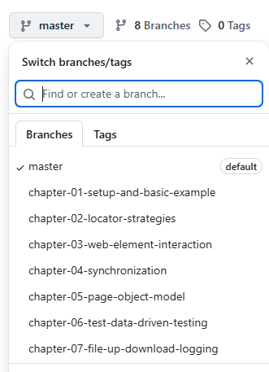

# Tutorial Selenium Java

https://github.com/mbachmann/selenium-java-tutorial

The solution per chapter is in the corresponding branch.

# Part 1

## Chapter 1: Introduction & Setup

* **task01:** Set up a Maven project with the latest Selenium version and Junit 5,
  Download the latest WebDriver from https://googlechromelabs.github.io/chrome-for-testing/, 
  dowload and install Allure and configure SLF4J logging together with Logback. 
* **task02:** Create a DriverFactory and a BaseTest class. Add a OsCheck and a MapAppender
* **task03:** Write a test that opens www.duckduckgo.com

## Chapter 2: Locator Strategies

* **task04:** Identify an input field using: ID, Name, CSS Selector, XPath
* **task05:** Create a LocatorOptions test class
* **task06:** Create a WikipediaLocator test class

## Chapter 3: WebElement Interaction

* **task07:** Write a test that does a login interaction
* **task08:** Test accepting a JavaScript alert
* **task09:** Switch to an iFrame and interact with a button
* **task10:** Use the action class for moving over an element 
* **task11:** Use the action class doing a context click
* **task12:** Use the action class for a drag and drop
* **task13:** Use the action class for sending a character with SHIFT key pressed 
* **task14:** Use the JavaScriptExecutor for a scrolling test

# Part 2

## Chapter 4: Synchronization

* Load a website with an intentionally delayed element
* Write two tests:
* **task01:** Using WebDriverWait and ExpectedConditions
* **task02:** Using FluentWait and ExpectedConditions 

## Chapter 5: Page Object Model

* **task03:** Refactor your Login test into LoginPage classes
* **task04:** Refactor your Login test into LoginPage and BasePage classes
* **task05:** Use PageFactory for Initialization with @FindBy

## Chapter 6: Test data management and test data driven testing

* **task06:** Use csv file for @ParameterizedTest with @CsvFileSource
* **task07:** Use data sample for @ParameterizedTest with @CsvSource
* **task08:** use JavaFaker to produce test data

## Chapter 7: File up- and download, Error Analysis & Logging

* **task09:** Test File upload
* **task10:** Test File download
* **task11:** test screenshots in case of errors and simulate an error and analyze the screenshot + log

## Chapter 8: Test Execution with Maven and Junit, implement Reporting

* **task12:** use surefire for text execution, use allure for test visualisation

## Chapter 9: Assertions and Validation

* Verify different Assertion Methods

## Chapter 10: Selenium Grid & Parallelization

* Start Selenium Grid via Docker
* Connect to a Chrome node via RemoteWebDriver
* Run three tests in parallel using JUnit5

